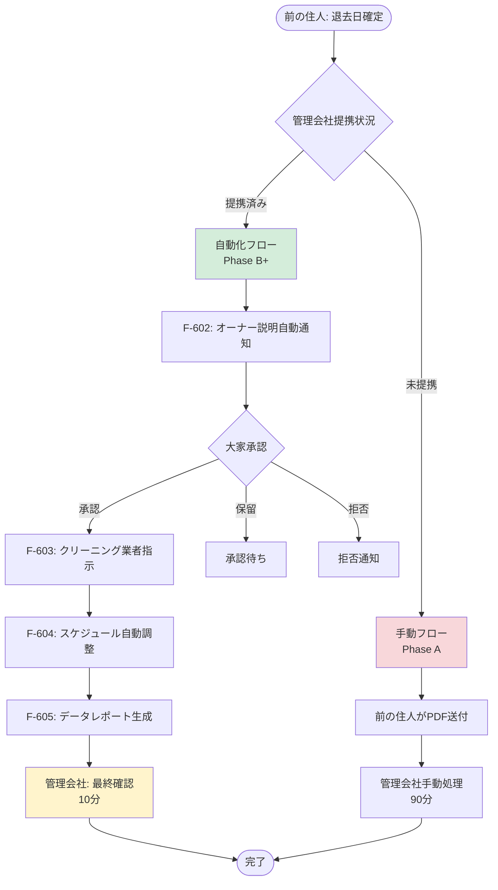

# 管理会社オペレーション自動化設計（Phase 2）

> 管理会社の作業時間を90分→10分に削減するテック自動化システム設計
>
> 関連機能: F-602（オーナー説明自動通知）、F-603（クリーニング業者指示自動送信）、F-604（スケジュール自動調整）、F-605（空室短縮データレポート）

最終更新日: 2026-02-16

---

## 前提条件

### Phase A（現行）の課題

Phase Aでは前の住人が管理会社に「残置物引き継ぎのご相談」PDFを渡し、管理会社が以下の作業を手動で実施:

1. **PDF確認・大家への転送**（20分）
   - PDFを読み、sumitsugiの仕組みを理解
   - 大家に転送し、承認を依頼
   - 大家からの返信を待つ

2. **前の住人への回答連絡**（10分）
   - 大家の承認結果を前の住人に電話/メールで通知
   - 前の住人がsumitsugiに手動入力

3. **クリーニング業者への指示**（30分）
   - 家具リストを確認
   - どの家具を残す/撤去するかを指示書として作成
   - 業者にメール送信

4. **スケジュール調整**（20分）
   - 退去日、クリーニング日、入居日を調整
   - 関係者（前の住人、次の住人、業者）と連絡
   - カレンダーに登録

5. **その他雑務**（10分）
   - 記録作成、社内報告など

**合計: 約90分/件**

### Phase B+の目標

上記作業をテック自動化により**10分/件**に削減:

- **自動化する作業**: 1, 2, 3, 4の大部分（80分削減）
- **残る手動作業**: 最終確認・承認のみ（10分）

---

## アーキテクチャ概要



---

## F-602: オーナー説明自動通知

### 概要

管理会社を経由せず、**sumitsugiから直接大家に説明メール + 承認リンクを送信**。F-611（残置物引き継ぎのご相談PDF）のテック版。

### トリガー条件

- 前の住人が退去日（`moveOutDate`）を設定
- 物件の管理会社が**提携済み**（`managementCompany.isPartner = true`）
- 管理会社が大家連絡先を登録済み（`managementCompany.landlordEmail`）

### 実装詳細

#### 1. データモデル拡張

**新規テーブル: `management_companies`**

```typescript
// src/lib/db/schema/management-companies.ts
export const managementCompanies = pgTable('management_companies', {
  id: text('id')
    .primaryKey()
    .$defaultFn(() => createId()),
  name: varchar('name', { length: 255 }).notNull(),

  // 提携情報
  isPartner: boolean('is_partner').default(false).notNull(),
  partnerSince: timestamp('partner_since'),

  // 連絡先
  contactEmail: varchar('contact_email', { length: 255 }),
  contactPhone: varchar('contact_phone', { length: 50 }),

  // 大家連絡先（提携済みの場合のみ）
  landlordEmail: varchar('landlord_email', { length: 255 }),
  landlordName: varchar('landlord_name', { length: 255 }),

  // 自動化設定
  autoNotifyLandlord: boolean('auto_notify_landlord').default(false).notNull(),
  autoSendCleaningInstructions: boolean('auto_send_cleaning_instructions')
    .default(false)
    .notNull(),

  // メタデータ
  createdAt: timestamp('created_at').defaultNow().notNull(),
  updatedAt: timestamp('updated_at').defaultNow().notNull(),
});
```

**`properties` テーブル拡張**

```typescript
// 既存の managementCompanyName (varchar) → managementCompanyId (FK) に変更
export const properties = pgTable('properties', {
  // ... 既存フィールド

  // Phase A: 管理会社名（文字列）
  managementCompanyName: varchar('management_company_name', { length: 255 }),

  // Phase B+: 管理会社ID（FK、提携済みの場合のみ）
  managementCompanyId: text('management_company_id').references(
    () => managementCompanies.id
  ),
});
```

#### 2. メール送信フロー

**トリガー: `moveOutDate`設定時のServer Action**

```typescript
// src/lib/actions/property-actions.ts
export async function setMoveOutDate(propertyId: string, moveOutDate: Date) {
  // 1. 物件情報を更新
  await db
    .update(properties)
    .set({ moveOutDate })
    .where(eq(properties.id, propertyId));

  // 2. 管理会社が提携済みかチェック
  const property = await db.query.properties.findFirst({
    where: eq(properties.id, propertyId),
    with: { managementCompany: true },
  });

  if (property?.managementCompany?.autoNotifyLandlord) {
    // 3. F-602: オーナー説明自動通知
    await sendLandlordNotification(propertyId);
  } else {
    // 3. Phase A: PDF生成のみ（手動送付）
    await generateManagementPDF(propertyId);
  }
}
```

**メールテンプレート: `landlord-notification.tsx`**

```typescript
// src/lib/email/templates/landlord-notification.tsx
export default function LandlordNotificationEmail({
  propertyAddress,
  moveOutDate,
  furnitureList,
  approvalLink,
  rejectionLink,
}: LandlordNotificationProps) {
  return (
    <Html>
      <Head />
      <Body>
        <Container>
          <Heading>残置物引き継ぎのご相談</Heading>

          <Text>
            いつもお世話になっております。
            {propertyAddress} のテナントより、退去時の家具引き継ぎについてご相談がございます。
          </Text>

          <Section>
            <Text><strong>退去予定日:</strong> {format(moveOutDate, 'yyyy年MM月dd日')}</Text>
            <Text><strong>引き継ぎ対象家具:</strong></Text>
            <ul>
              {furnitureList.map((item) => (
                <li key={item.id}>{item.name} - {item.price}円</li>
              ))}
            </ul>
          </Section>

          <Text>
            sumitsugiを通じて次の入居者に家具を引き継ぐことで、空室期間の短縮が見込まれます。
          </Text>

          <Section style={{ marginTop: '24px' }}>
            <Button href={approvalLink} style={{ backgroundColor: '#28a745' }}>
              承認する（内見後に正式判断）
            </Button>
            <Button href={rejectionLink} style={{ backgroundColor: '#dc3545', marginLeft: '12px' }}>
              お断りする
            </Button>
          </Section>

          <Text style={{ fontSize: '12px', color: '#6c757d' }}>
            ※このメールは管理会社経由でsumitsugiから送信されています。
          </Text>
        </Container>
      </Body>
    </Html>
  )
}
```

#### 3. 承認フロー API

**承認リンク: `/api/landlord/approve/:token`**

```typescript
// src/app/api/landlord/approve/[token]/route.ts
export async function GET(
  request: Request,
  { params }: { params: { token: string } }
) {
  // 1. トークン検証
  const payload = verifyLandlordToken(params.token);

  // 2. ステータス更新
  await db
    .update(properties)
    .set({
      landlordConsent: {
        status: 'conditional', // 事前承認（内見後に正式判断）
        approvedAt: new Date(),
        approvedBy: 'landlord',
      },
    })
    .where(eq(properties.id, payload.propertyId));

  // 3. 前の住人に通知
  await sendNotificationToSeller(payload.propertyId, 'conditional');

  // 4. 次のステップ（F-603）をトリガー
  await sendCleaningInstructions(payload.propertyId);

  return NextResponse.redirect('/landlord/approval-success');
}
```

### 削減される作業時間

- **Phase A**: 管理会社がPDF転送 + 大家に説明（20分）
- **Phase B+**: 自動送信、管理会社は確認のみ（2分）
- **削減: 18分**

---

## F-603: クリーニング業者向け指示自動送信

### 概要

家具リストから「残す/撤去」指示を自動生成し、クリーニング業者にメール送信。

### トリガー条件

- 大家が事前承認（`landlordConsent.status = 'conditional'`）
- または、内見後に家具リスト確定（`agreedFurnitureIds` 設定時）

### 実装詳細

#### 1. 指示書生成ロジック

```typescript
// src/lib/cleaning/generate-instructions.ts
export async function generateCleaningInstructions(propertyId: string) {
  const property = await db.query.properties.findFirst({
    where: eq(properties.id, propertyId),
  });

  if (!property) throw new Error('Property not found');

  const instructions = {
    propertyAddress: property.address,
    moveOutDate: property.moveOutDate,

    // 残す家具（sumitsugi経由で引き継ぎ）
    keepItems: property.furnitureItems.filter(
      (item: FurnitureItem) => item.included
    ),

    // 撤去する家具（通常通り撤去）
    removeItems: property.furnitureItems.filter(
      (item: FurnitureItem) => !item.included
    ),

    // 特記事項
    notes:
      '※sumitsugi引き継ぎ対象家具は、次の入居者が使用するまで現状保管してください。',
  };

  return instructions;
}
```

#### 2. メール送信

**テンプレート: `cleaning-instructions.tsx`**

```typescript
// src/lib/email/templates/cleaning-instructions.tsx
export default function CleaningInstructionsEmail({
  propertyAddress,
  moveOutDate,
  keepItems,
  removeItems,
}: CleaningInstructionsProps) {
  return (
    <Html>
      <Body>
        <Container>
          <Heading>退去クリーニング指示書</Heading>

          <Section>
            <Text><strong>物件:</strong> {propertyAddress}</Text>
            <Text><strong>退去日:</strong> {format(moveOutDate, 'yyyy年MM月dd日')}</Text>
          </Section>

          <Section>
            <Heading as="h2">【残置家具（保管）】</Heading>
            <Text>以下の家具は次の入居者が使用します。現状保管をお願いします。</Text>
            <table>
              <thead>
                <tr>
                  <th>家具名</th>
                  <th>設置場所</th>
                  <th>備考</th>
                </tr>
              </thead>
              <tbody>
                {keepItems.map((item) => (
                  <tr key={item.id}>
                    <td>{item.name}</td>
                    <td>{item.location || '-'}</td>
                    <td>{item.notes || '-'}</td>
                  </tr>
                ))}
              </tbody>
            </table>
          </Section>

          <Section>
            <Heading as="h2">【撤去家具】</Heading>
            <Text>以下の家具は通常通り撤去・処分してください。</Text>
            <ul>
              {removeItems.map((item) => (
                <li key={item.id}>{item.name}</li>
              ))}
            </ul>
          </Section>

          <Text style={{ fontSize: '12px', color: '#6c757d' }}>
            ご不明点は管理会社までお問い合わせください。
          </Text>
        </Container>
      </Body>
    </Html>
  )
}
```

#### 3. 送信タイミング

```typescript
// src/lib/actions/cleaning-actions.ts
export async function sendCleaningInstructions(propertyId: string) {
  // 1. 指示書生成
  const instructions = await generateCleaningInstructions(propertyId);

  // 2. クリーニング業者のメールアドレス取得
  const property = await db.query.properties.findFirst({
    where: eq(properties.id, propertyId),
    with: { managementCompany: true },
  });

  const cleaningEmail = property?.managementCompany?.cleaningVendorEmail;
  if (!cleaningEmail) {
    throw new Error('Cleaning vendor email not configured');
  }

  // 3. メール送信
  await resend.emails.send({
    from: 'sumitsugi <notifications@sumitsugi.jp>',
    to: cleaningEmail,
    cc: property.managementCompany.contactEmail, // 管理会社もCC
    subject: `【sumitsugi】退去クリーニング指示書 - ${property.address}`,
    react: CleaningInstructionsEmail(instructions),
  });

  // 4. 送信記録
  await db
    .update(properties)
    .set({
      cleaningInstructionsSentAt: new Date(),
    })
    .where(eq(properties.id, propertyId));
}
```

### 削減される作業時間

- **Phase A**: 家具リスト確認 + 指示書作成 + 送信（30分）
- **Phase B+**: 自動生成・送信、管理会社は確認のみ（3分）
- **削減: 27分**

---

## F-604: 引き継ぎスケジュール自動調整

### 概要

退去日・入居日・クリーニング日程のカレンダー連携。F-614（日程調整テンプレート）のテック版。

### トリガー条件

- 次の住人の入居希望日が確定（`inquiry.desiredMoveInDate` 設定時）
- 大家が正式承認（`landlordConsent.status = 'approved'`）

### 実装詳細

#### 1. スケジュール計算ロジック

```typescript
// src/lib/schedule/calculate-handover-schedule.ts
export function calculateHandoverSchedule(
  moveOutDate: Date,
  desiredMoveInDate: Date
): HandoverSchedule {
  // 最適なスケジュールを計算
  const cleaningDuration = 2; // クリーニング所要日数（デフォルト2日）

  // 退去日の翌日からクリーニング開始
  const cleaningStartDate = addDays(moveOutDate, 1);
  const cleaningEndDate = addDays(cleaningStartDate, cleaningDuration);

  // クリーニング完了後、最短で入居可能
  const earliestMoveInDate = addDays(cleaningEndDate, 1);

  // 希望日が最短日より前なら警告
  const isDesiredDateFeasible =
    isAfter(desiredMoveInDate, earliestMoveInDate) ||
    isSameDay(desiredMoveInDate, earliestMoveInDate);

  return {
    moveOutDate,
    cleaningStartDate,
    cleaningEndDate,
    proposedMoveInDate: isDesiredDateFeasible
      ? desiredMoveInDate
      : earliestMoveInDate,
    isDesiredDateFeasible,
    vacancyDays: differenceInDays(earliestMoveInDate, moveOutDate),
  };
}
```

#### 2. カレンダー連携（Google Calendar API）

```typescript
// src/lib/calendar/sync-to-calendar.ts
import { google } from 'googleapis';

export async function syncHandoverSchedule(
  propertyId: string,
  schedule: HandoverSchedule
) {
  // 管理会社のGoogleカレンダーにイベント作成
  const property = await db.query.properties.findFirst({
    where: eq(properties.id, propertyId),
    with: { managementCompany: true },
  });

  const calendarId = property?.managementCompany?.googleCalendarId;
  if (!calendarId) {
    // カレンダー連携未設定の場合はスキップ
    return;
  }

  const auth = await getGoogleAuthClient();
  const calendar = google.calendar({ version: 'v3', auth });

  // 退去イベント
  await calendar.events.insert({
    calendarId,
    requestBody: {
      summary: `【退去】${property.address}`,
      start: { date: format(schedule.moveOutDate, 'yyyy-MM-dd') },
      end: { date: format(addDays(schedule.moveOutDate, 1), 'yyyy-MM-dd') },
      description: 'sumitsugi経由の家具引き継ぎあり',
    },
  });

  // クリーニングイベント
  await calendar.events.insert({
    calendarId,
    requestBody: {
      summary: `【クリーニング】${property.address}`,
      start: { date: format(schedule.cleaningStartDate, 'yyyy-MM-dd') },
      end: { date: format(addDays(schedule.cleaningEndDate, 1), 'yyyy-MM-dd') },
      description: '残置家具あり - 現状保管',
    },
  });

  // 入居イベント
  await calendar.events.insert({
    calendarId,
    requestBody: {
      summary: `【入居】${property.address}`,
      start: { date: format(schedule.proposedMoveInDate, 'yyyy-MM-dd') },
      end: {
        date: format(addDays(schedule.proposedMoveInDate, 1), 'yyyy-MM-dd'),
      },
      description: 'sumitsugi経由 - 家具引き継ぎあり',
    },
  });
}
```

#### 3. 関係者への通知

```typescript
// src/lib/schedule/notify-schedule.ts
export async function notifyHandoverSchedule(
  propertyId: string,
  schedule: HandoverSchedule
) {
  const property = await db.query.properties.findFirst({
    where: eq(properties.id, propertyId),
    with: { seller: true, inquiry: { with: { buyer: true } } },
  });

  // 前の住人に通知
  await resend.emails.send({
    from: 'sumitsugi <notifications@sumitsugi.jp>',
    to: property.seller.email,
    subject: '引き継ぎスケジュール確定のお知らせ',
    react: ScheduleNotificationEmail({
      role: 'seller',
      schedule,
      propertyAddress: property.address,
    }),
  });

  // 次の住人に通知
  await resend.emails.send({
    from: 'sumitsugi <notifications@sumitsugi.jp>',
    to: property.inquiry.buyer.email,
    subject: '入居スケジュール確定のお知らせ',
    react: ScheduleNotificationEmail({
      role: 'buyer',
      schedule,
      propertyAddress: property.address,
    }),
  });

  // 管理会社に通知
  await resend.emails.send({
    from: 'sumitsugi <notifications@sumitsugi.jp>',
    to: property.managementCompany.contactEmail,
    subject: `【sumitsugi】引き継ぎスケジュール - ${property.address}`,
    react: ScheduleNotificationEmail({
      role: 'management',
      schedule,
      propertyAddress: property.address,
    }),
  });
}
```

### 削減される作業時間

- **Phase A**: 関係者に個別連絡 + 調整 + カレンダー登録（20分）
- **Phase B+**: 自動計算・カレンダー同期・通知（1分）
- **削減: 19分**

---

## F-605: 空室短縮データレポート

### 概要

「sumitsugi経由で空室○日短縮」を証明するデータを管理会社に提供。

### データ収集

```typescript
// src/lib/analytics/vacancy-reduction.ts
export async function calculateVacancyReduction(propertyId: string) {
  const property = await db.query.properties.findFirst({
    where: eq(properties.id, propertyId),
    with: { inquiry: true },
  });

  if (!property?.moveOutDate || !property.inquiry?.agreedMoveInDate) {
    return null;
  }

  // 実際の空室期間
  const actualVacancyDays = differenceInDays(
    property.inquiry.agreedMoveInDate,
    property.moveOutDate
  );

  // 地域・物件タイプの平均空室期間（外部データ or 自社統計）
  const averageVacancyDays = await getAverageVacancyDays({
    prefecture: property.prefecture,
    propertyType: property.propertyType,
  });

  // 短縮日数
  const reductionDays = averageVacancyDays - actualVacancyDays;

  // 空室による損失削減額（家賃 × 短縮日数 / 30）
  const rentPerDay = property.rentPrice / 30;
  const savingsAmount = Math.round(rentPerDay * reductionDays);

  return {
    actualVacancyDays,
    averageVacancyDays,
    reductionDays,
    savingsAmount,
    furnitureHandoverFee: property.handoverFee,
  };
}
```

### レポート生成

```typescript
// src/lib/reports/generate-vacancy-report.ts
export async function generateVacancyReport(
  managementCompanyId: string,
  startDate: Date,
  endDate: Date
) {
  // 期間内の全取引を取得
  const properties = await db.query.properties.findMany({
    where: and(
      eq(properties.managementCompanyId, managementCompanyId),
      gte(properties.createdAt, startDate),
      lte(properties.createdAt, endDate),
      eq(properties.landlordConsent.status, 'approved') // 成約済みのみ
    ),
  });

  // 各物件の空室短縮データを集計
  const reductions = await Promise.all(
    properties.map((p) => calculateVacancyReduction(p.id))
  );

  const report = {
    period: { startDate, endDate },
    totalProperties: properties.length,
    totalReductionDays: reductions.reduce(
      (sum, r) => sum + (r?.reductionDays || 0),
      0
    ),
    totalSavings: reductions.reduce(
      (sum, r) => sum + (r?.savingsAmount || 0),
      0
    ),
    averageReductionDays:
      reductions.reduce((sum, r) => sum + (r?.reductionDays || 0), 0) /
      properties.length,
    properties: reductions,
  };

  return report;
}
```

### レポート配信

```typescript
// src/lib/cron/monthly-reports.ts
// Vercel Cronで毎月1日に実行
export async function sendMonthlyReports() {
  const partnerCompanies = await db.query.managementCompanies.findMany({
    where: eq(managementCompanies.isPartner, true),
  });

  for (const company of partnerCompanies) {
    // 前月のレポート生成
    const lastMonth = subMonths(new Date(), 1);
    const startDate = startOfMonth(lastMonth);
    const endDate = endOfMonth(lastMonth);

    const report = await generateVacancyReport(company.id, startDate, endDate);

    // レポートPDF化
    const reportPdf = await generateReportPDF(report);

    // メール送信
    await resend.emails.send({
      from: 'sumitsugi <reports@sumitsugi.jp>',
      to: company.contactEmail,
      subject: `【sumitsugi】${format(lastMonth, 'yyyy年MM月')}の空室短縮レポート`,
      react: MonthlyReportEmail({ company, report }),
      attachments: [
        {
          filename: `vacancy-report-${format(lastMonth, 'yyyy-MM')}.pdf`,
          content: reportPdf,
        },
      ],
    });
  }
}
```

### 削減される作業時間

Phase Aでは実施していない追加機能（管理会社へのデータ提供による信頼構築）。

---

## 段階的導入計画

### Phase B（物件20-50件）

**優先度: P2（Phase 2実装）**

#### 提携管理会社の獲得

- Phase Aで複数件の相談を受けた管理会社にアプローチ
- 提携条件: 自動化システムの利用、大家連絡先の登録

#### 実装順序

1. **Week 1-2**: データモデル構築（`management_companies`テーブル）
2. **Week 3-4**: F-602（オーナー説明自動通知）実装
3. **Week 5-6**: F-603（クリーニング業者指示）実装
4. **Week 7-8**: F-604（スケジュール自動調整）実装
5. **Week 9-10**: F-605（データレポート）実装

#### 並行運用

- 提携済み管理会社: 自動化フロー（Phase B+）
- 未提携管理会社: 手動フロー（Phase A）継続

### Phase C（物件50件以上）

**優先度: P3（Phase 3実装）**

#### フィー廃止 → データ提供モデル

- 管理会社紹介フィー（¥3,000→¥1,500）を廃止
- 代わりに空室短縮データレポートを提供
- 管理会社のKPI改善に貢献

#### 追加自動化

- AI自動応答（管理会社への問い合わせ対応）
- 予測分析（空室リスク予測、最適退去日提案）
- ダッシュボード提供（管理会社向けポータル）

---

## 技術スタック

### バックエンド

- **メール送信**: Resend + React Email（既存パイプライン活用）
- **カレンダー連携**: Google Calendar API（OAuth 2.0）
- **PDF生成**: `@react-pdf/renderer`（F-611/F-612と同様）
- **Cron Jobs**: Vercel Cron（月次レポート配信）

### データベース

- **新規テーブル**: `management_companies`
- **既存テーブル拡張**: `properties.managementCompanyId` (FK)

### 外部API

- **Google Calendar API**: スケジュール同期
- **不動産統計API**: 平均空室期間データ（候補: REINS API or 自社統計）

---

## セキュリティ・プライバシー

### 大家連絡先の取り扱い

- 管理会社のみが登録可能（前の住人からは見えない）
- メール送信時は管理会社もCCに含める（透明性確保）
- 大家の承認/拒否はトークン認証（署名付きURL）

### データ保護

- 大家の承認履歴は暗号化保存
- カレンダー連携はOAuth 2.0、スコープ最小化
- レポートは管理会社のみアクセス可能

---

## 成功指標（KPI）

### 管理会社側

- **作業時間削減率**: 90分→10分（88%削減）
- **対応可能件数**: 10件/日 → 90件/日（9倍）
- **ヒューマンエラー削減**: 指示ミス件数の削減

### sumitsugi側

- **提携管理会社数**: Phase Bで5社、Phase Cで20社
- **自動化率**: Phase Bで50%、Phase Cで90%
- **顧客満足度**: 管理会社NPS +50以上

---

## リスクと対策

### リスク1: 管理会社が提携に消極的

**対策**: Phase Aで実績を作り、作業削減効果を数値で証明（空室短縮データレポート）

### リスク2: 大家が自動通知を嫌がる

**対策**: 管理会社も必ずCCに含め、「管理会社経由」であることを明示。拒否時は即座に手動フローに切り替え。

### リスク3: システム障害時のフォールバック

**対策**: 自動送信失敗時は管理会社にアラート + Phase A手動フローに自動切り替え。

---

## 関連ドキュメント

- [F-611実装（残置物引き継ぎのご相談PDF）](./pdf-generation.md)
- [メール送信アーキテクチャ（T-2）](./email-system.md)
- [大家承諾フロー図](./approval-flow.md)
- [B2B連携要件（F-601〜F-616）](../../requirements/features/b2b.md)

---

以上
