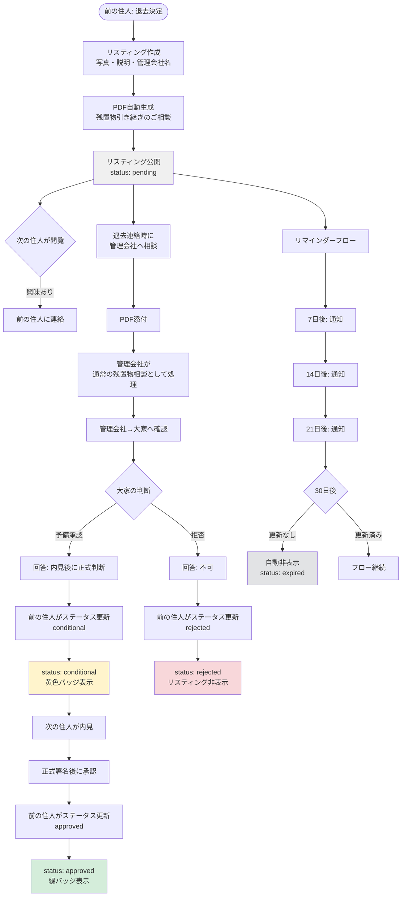
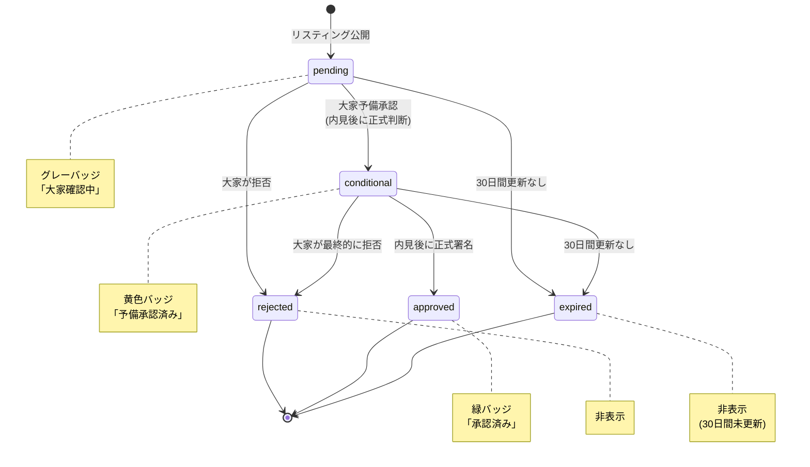
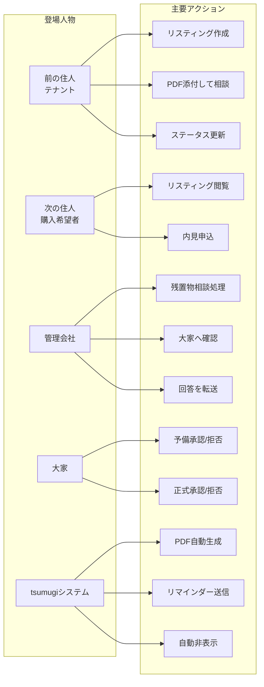

# tsumugi 大家承諾フロー図

本ドキュメントは、tsumugiの残置物引き継ぎにおける大家承諾フローを可視化したものです。
Figma図作成時の参考資料として使用してください。

---

## 1. メインフロー図（全体プロセス）

---

## 2. ステータス遷移図（ConsentStatus）

---

## 3. ステータス別表示仕様

| ConsentStatus | 日本語表示   | バッジ色 | 表示状態 | 説明                                       |
| ------------- | ------------ | -------- | -------- | ------------------------------------------ |
| `pending`     | 大家確認中   | グレー   | 公開     | リスティング作成直後、管理会社への確認待ち |
| `conditional` | 予備承認済み | 黄色     | 公開     | 大家が予備承認、内見後に正式判断           |
| `approved`    | 承認済み     | 緑       | 公開     | 大家が正式承認、引き継ぎ可能               |
| `rejected`    | 不可         | -        | 非表示   | 大家が拒否、リスティング非公開             |
| `expired`     | 期限切れ     | -        | 非表示   | 30日間更新なし、自動非表示                 |

---

## 4. リマインダースケジュール

```mermaid
gantt
    title リマインダー通知スケジュール
    dateFormat  D
    axisFormat %d日

    section リマインダー
    公開           :milestone, m1, 0, 0d
    1回目通知      :milestone, m2, 7, 0d
    2回目通知      :milestone, m3, 14, 0d
    3回目通知      :milestone, m4, 21, 0d
    自動非表示     :crit, milestone, m5, 30, 0d
```

**通知タイミング:**

- Day 0: リスティング公開
- Day 7: 1回目リマインダー
- Day 14: 2回目リマインダー
- Day 21: 3回目リマインダー（最終警告）
- Day 30: 自動非表示（status: expired）

---

## 5. 登場人物と役割

---

## 6. 実装上の注意点

### 前の住人側

- リスティング作成時に管理会社名を必須入力
- PDF生成は自動（管理会社名を含む）
- ステータス更新は手動（管理会社からの回答を受けて）
- リマインダー通知を確認して期限内に更新

### 次の住人側

- ステータスバッジで承認状況を確認
- pending/conditional でも興味があれば連絡可能
- approved になったら引き継ぎ確実

### システム側

- PDF生成: 管理会社名、物件情報、残置物リストを含む
- リマインダー: 7/14/21/30日で自動送信
- 自動非表示: 30日後にステータスを expired に変更

---

## 7. Figma作成時のポイント

1. **レーン分け**: 前の住人、次の住人、管理会社、大家、システムの5レーン
2. **色分け**: ステータス別に色を統一（グレー/黄色/緑/赤/灰色）
3. **PDF**: 実際のフォーマットのモックアップを含める
4. **通知UI**: リマインダー通知のモックアップ
5. **バッジデザイン**: pending/conditional/approved の3種類のバッジ
6. **タイムライン**: 0日〜30日のタイムラインを視覚化

---

以上
