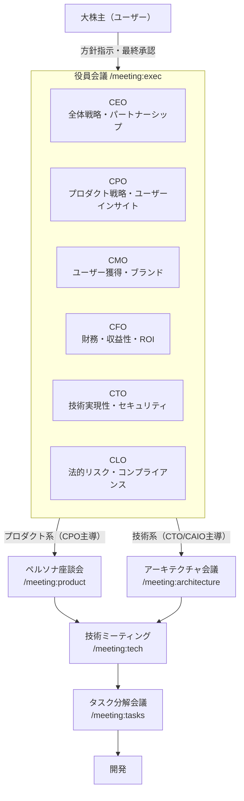
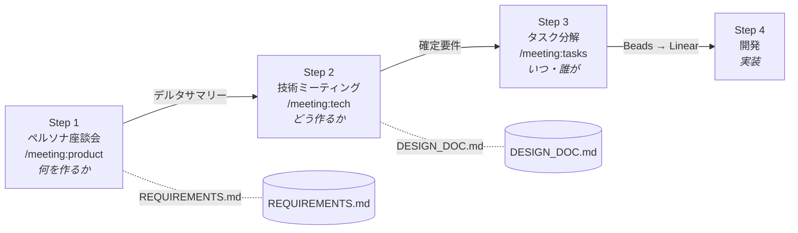
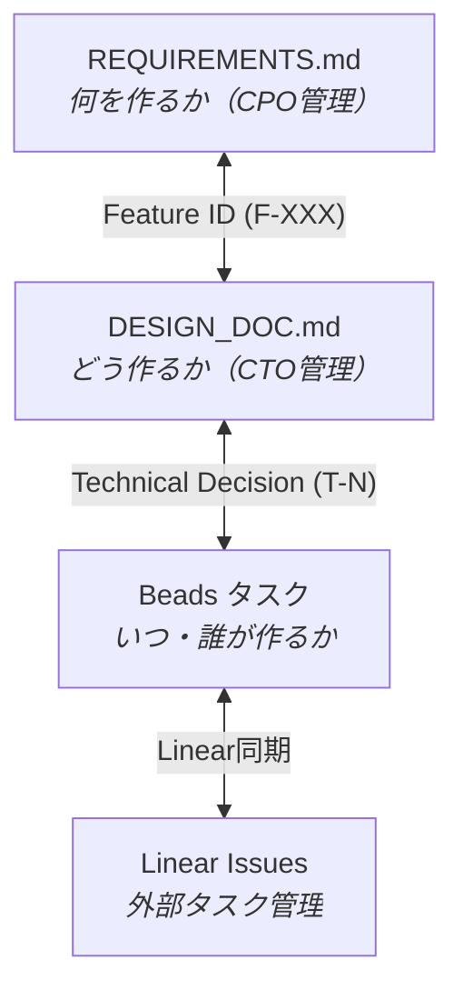

# tsumugi 組織運営フロー

> チームの意思決定がどう流れ、プロダクトがどう形になるか

---

## 組織図

---

## 意思決定の流れ（トップダウン）

### Level 1: 大株主

- **役割:** 方針を示し、最終決定を下す
- **権限:** 全ての承認・却下、戦略方向性の決定
- **関わり方:** 役員会議に議題を出す、各会議の最終承認

### Level 2: 役員会議（/meeting:exec）

- **参加者:** CEO, CPO, CMO, CFO, CTO, CLO
- **目的:** 経営戦略の議論と合意形成
- **インプット:** 大株主の指示、各役員のknowledgeフォルダ
- **アウトプット:** 戦略方針、経営判断、各役員への指示
- **特徴:** 各役員が自分のknowledgeフォルダを参照し、毎回の会議で学びを蓄積

### Level 3: 専門会議（CPO/CTO主導）

意思決定の内容に応じて、適切な専門会議が開催される。

---

## ミーティングパイプライン

プロダクトの要件が確定し、実装されるまでの主要フロー:

### Step 1: ペルソナ座談会（/meeting:product）

- **主導:** CPO（ファシリテーター）
- **参加者:** 16ペルソナ（前の住人5名、次の住人5名、ステークホルダー6名）
- **目的:** ユーザーの声から「何を作るべきか」を決める
- **手法:** ペルソナ同士が議論（インタビュー形式ではない）
- **アウトプット:**
  - REQUIREMENTS.md の更新
  - デルタサマリー（変更点のみ記載、`docs/meetings/` に保存）

### Step 2: 技術ミーティング（/meeting:tech）

- **主導:** CPO（質問する側）
- **参加者:** CPO, CTO, CAIO
- **目的:** 要件の技術的実現可能性を検証し、バランスを取る
- **インプット:** Step 1 のデルタサマリー
- **手法:**
  - モードA（クイック）: 各要件の実現可否判定（✅/⚠️/❌）
  - モードB（ディープ）: アーキテクチャ設計、T-N技術決定
- **アウトプット:**
  - REQUIREMENTS.md の調整（技術制約を反映）
  - DESIGN_DOC.md の更新（T-Nエントリ追加）

### Step 3: タスク分解（/meeting:tasks）

- **主導:** CPO + CTO
- **目的:** 確定要件を具体的な開発タスクに分解
- **手法:** CPOがユーザー価値視点、CTOが技術視点で優先度を議論
- **アウトプット:**
  - タスクリスト（Refs: F-XXXで要件にトレーサブル）
  - Beadsタスク作成 → Linear同期
  - 大株主の承認

### Step 4: 開発

- TDD（テスト駆動開発）で実装
- PRは~300行以内、CI全チェック必須
- コードレビュー → マージ

---

## 補助会議

メインパイプライン以外に、必要に応じて開催される会議:

| 会議                    | 主導       | 目的                                | いつ使う                     |
| ----------------------- | ---------- | ----------------------------------- | ---------------------------- |
| `/meeting:architecture` | CTO + CAIO | システム設計、データモデル、API設計 | 新しい技術基盤が必要な時     |
| `/meeting:tools`        | CTO + CAIO | ツール・技術選定の評価              | 新しいツール導入を検討する時 |
| `/meeting:exec`         | 全役員     | 経営戦略、優先順位                  | 戦略判断が必要な時           |

---

## 役員の責務

| 役職     | 担当領域                                              | 主要ドキュメント             |
| -------- | ----------------------------------------------------- | ---------------------------- |
| **CEO**  | 全体戦略、パートナーシップ、法務窓口                  | [STRATEGY](ceo/STRATEGY.md)  |
| **CPO**  | プロダクト戦略、要件管理、ペルソナ座談会運営          | （統合予定）                 |
| **CMO**  | マーケティング、ブランド、ユーザー獲得                | [STRATEGY](cmo/STRATEGY.md)  |
| **CFO**  | 財務計画、コスト管理、ROI分析                         | [STRATEGY](cfo/STRATEGY.md)  |
| **CTO**  | 技術アーキテクチャ、実装、セキュリティ                | [STRATEGY](cto/STRATEGY.md)  |
| **CLO**  | 法的リスク分析、規約レビュー（※最終判断は外部弁護士） | [STRATEGY](clo/STRATEGY.md)  |
| **CAIO** | AI活用戦略、AI/ML実装、自動化                         | [STRATEGY](caio/STRATEGY.md) |
| **CoS**  | タスク具体化、調査、進捗管理                          | [STRATEGY](cos/STRATEGY.md)  |

---

## ナレッジ管理

各役員は `docs/team/{role}/knowledge/` フォルダに学びを蓄積する:

- 会議での重要なインサイト
- 競合分析、トレンド、ベストプラクティス
- 過去の意思決定とその結果
- ファイル名: `YYYY-MM-DD-HHMM.md`（タイムスタンプ形式）

**役員会議前に各自のknowledgeフォルダを参照し、最新情報を議論に持ち込む。**

---

## ドキュメント体系

**トレーサビリティ:** 全てのタスクはF-XXX（要件）またはT-N（技術決定）に紐づく。要件→設計→タスク→実装を一貫して追跡可能。

---

## ワークフロー改善

ミーティングパイプラインの改善履歴は [WORKFLOW_CHANGELOG.md](../meetings/WORKFLOW_CHANGELOG.md) に記録。
